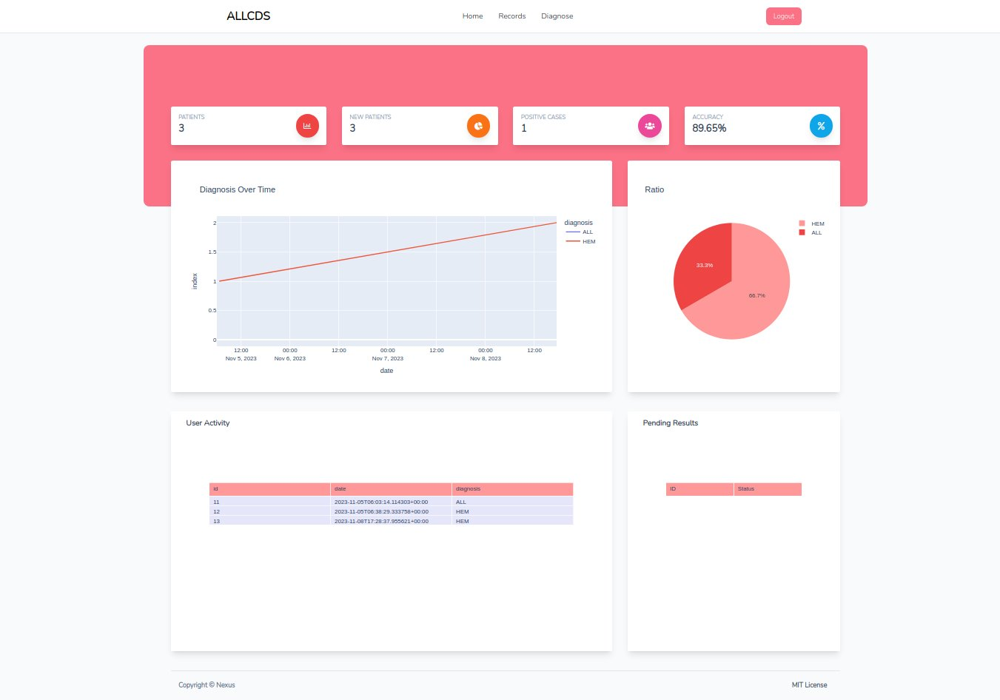
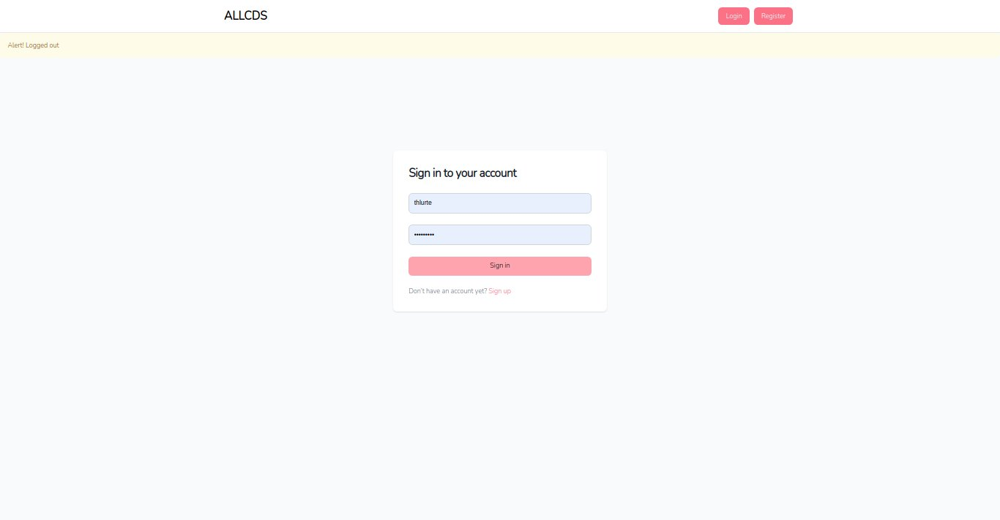
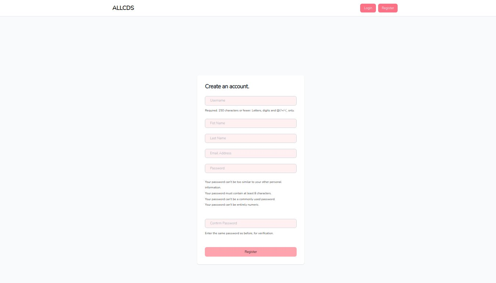
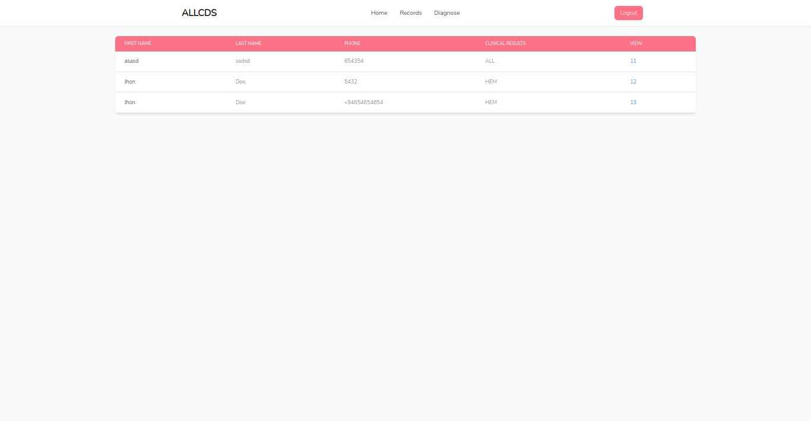
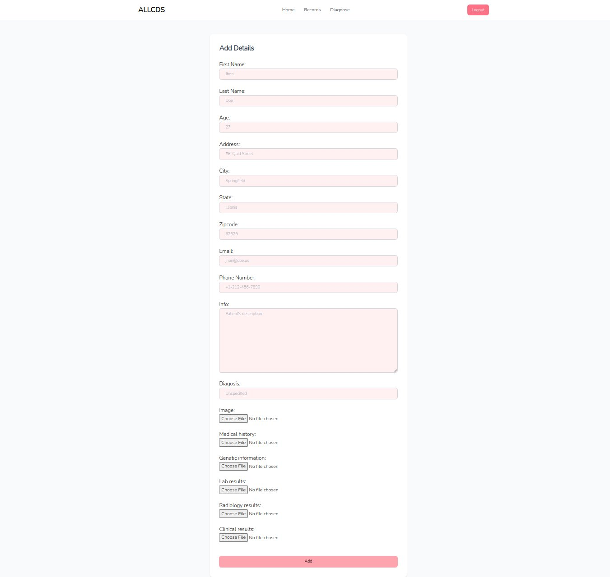

<div align="center">

# Acute lymphoblastic leukemia Diagnosis System

 <a href="https://github.com/thlurte/dots/stargazers">
        
    </a>
 <a href="https://github.com/thlurte/dots/stargazers">
        
    </a>

[Getting started](#getting-started) 
[Installation](#installation) 
[Configuration](#configuration) 
[Integrations](#contributors)
</div>
<p>
Welcome to ALLCDS, a user-friendly web application designed for the precise identification of leukemia cells. Leveraging the power of pre-trained Convolutional Neural Networks (CNNs) in TensorFlow, coupled with the seamless integration of Django APIs, ALLCDS ensures a smooth experience for users.
</p>


## Key Features

- CNN Architecture: Utilizes state-of-the-art pre-trained CNNs for accurate cell identification.

- TensorFlow Integration: Leverages the robust TensorFlow framework for efficient machine learning operations.

- Django APIs: Seamlessly integrates with Django APIs to handle core logic, database interactions, model management, and user interface components.

## Enhanced User Experience

ALLCDS goes beyond functionality, focusing on an intuitive and enhanced user experience. The application streamlines the process of identifying leukemia cells, making it accessible to both professionals and users with varying levels of technical expertise.

## Getting started
Clone the repository and follow the steps below to quickly set up ALLCDS on your local machine. Start identifying leukemia cells with just a few simple steps!

## Preview







### Prerequisites
- Python: 3.8 or 3.9
- TensorFlow: 2.14.0
- Django: 4.2.5
- Plotly: 5.18.0

### Installation
1. Clone the ALLCDS repository:
```bash
git clone https://github.com/thlurte/ALLCDS.git
```
2. Navigate to the project directory:
```bash
cd ALLCDS
```
3. Install the required dependencies:
```bash
pip install -r requirements.txt
```
4. Run the application
```bash
python manage.py runserver
```

Visit [http://localhost:8000](http://localhost:8000) in your browser to access ALLCDS.

### Configuration
Configure ALLCDS by updating the settings in the `settings.py` file. Ensure that you set up the database connection and any other necessary parameters according to your environment.

#### Output Structure
```
├── allcds
│   ├── admin.py
│   ├── apps.py
│   ├── forms.py
│   ├── migrations
│   ├── model
│   │   └── weights
│   │       └── content
│   │           └── wb.h5
│   ├── models.py
│   ├── templates
│   │   ├── add_records.html
│   │   ├── base.html
│   │   ├── home.html
│   │   ├── navbar.html
│   │   ├── pat_records.html
│   │   ├── records.html
│   │   ├── register.html
│   │   └── up_record.html
│   ├── tests.py
│   ├── urls.py
│   └── views.py
├── manage.py
├── media
│   ├── clinical_results
│   ├── genatic_information
│   ├── images
│   ├── lab_results
│   ├── medical_history
│   └── radiology_results
└── Nexus
    ├── asgi.py
    ├── settings.py
    ├── urls.py
    └── wsgi.py
```
### Database Configuration

```python
# /Nexus/settings.py/ln-78
DATABASES = {
    'default': {
        'ENGINE': 'django.db.backends.mysql',
        'NAME':'allcds',
        'USER':'root',
        'PASSWORD':'',
        'HOST':'127.0.0.1',
        'PORT':'3348',
        }
}
```
## Contribution

We appreciate contributions! If you'd like to contribute to ALLCDS, please follow these guidelines:

- Fork the repository.
- Create a new branch for your feature or bug fix.
- Make your changes and submit a pull request.
